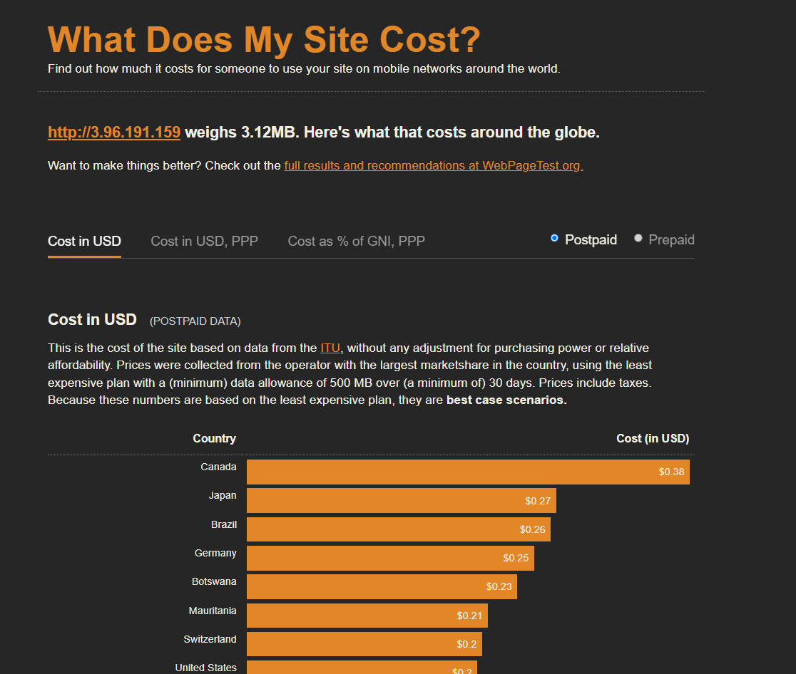
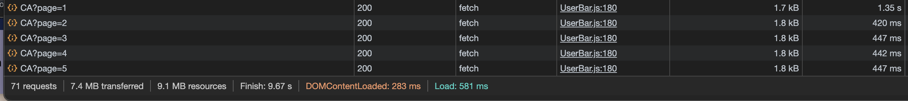
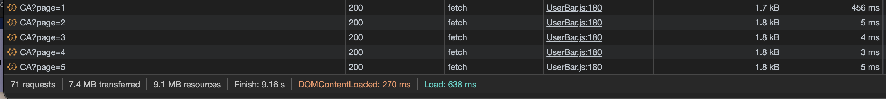

# Performance of Beyond our Earth

## Introduction and Methodology
<!-- Briefly state how you gathered data about app performance, and in what environment 
(which browsers, what browser versions, what kind of device, OS,
width and height of viewport as reported in the console with `window.screen) -->

First thing I used to gather data was the profiler. I used it in Google Chrome x4 throttling on my pc.
Second thing was noticed while on network tab and using lighthouse report.
Third tool was interacting with the app.

<!-- Also report overall impact on whatdoesmysitecost results before and after all your changes -->
### Before whatdoesmysitecost results

### After whatdoesmysitecost results

## Baseline Performance

<!-- Summarize initial results for each tool that you used. Did the tools
detect all the performance issues you see as a user? -->
Profiler shows that the Main component is being re-rendered on every interaction with the app.
While on the network tab and light house. A lot of resources are being requested for the 3rd party library cesium/resium.
While interacting I noticed that clicking next page in the "View meteorites in your country mode" is very slow.

## Areas to Improve
- Resource fetching
- Speed of next page clicks for next country

## Summary of Changes 

<!-- Briefly describe each change and the impact it had one performance (be specific). If there
was no performance improvement, explain why that might be the case -->

### Cache initial Globe resources

Lead: Kayci
I used memo from react to make sure the Globe component only re-render if the props have changed because the library resium
is the one that caused us to have such a low performance grade in the lighthouse report (49). Unfortunetly it didn't any performance improvements 
because I do not really have access to the Resium resources so I can cache. The constant download of resource images is what would have been needed to improve the resource fetching rather than using memo to reduce rendering and therefore image resources.
Lead: Israel Aristide

### The problem
When going through the meteors present on your own country, the fetches always take over 400ms and it makes things feels sluggish. 

### The solution
Caching! In the server i implemented a cache for the meteorites in a given country, this reduced the time to fetch after the first time significantly.

## Conclusion

<!-- Summarize which changes had the greatest impact, note any surprising results and list 2-3 main 
things you learned from this experience. -->